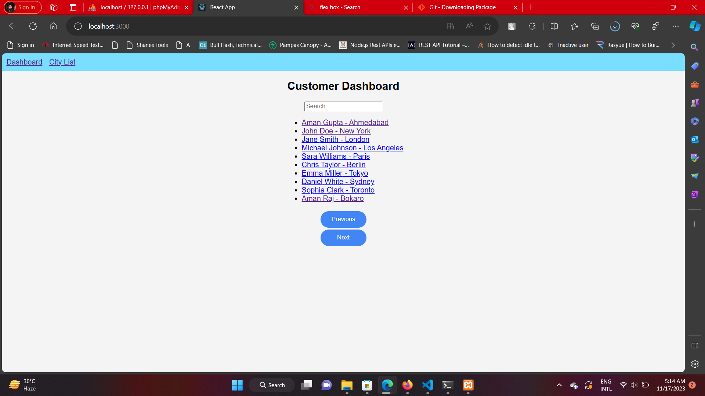
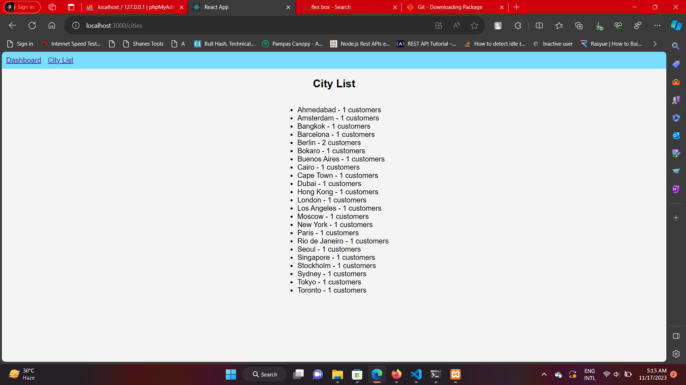
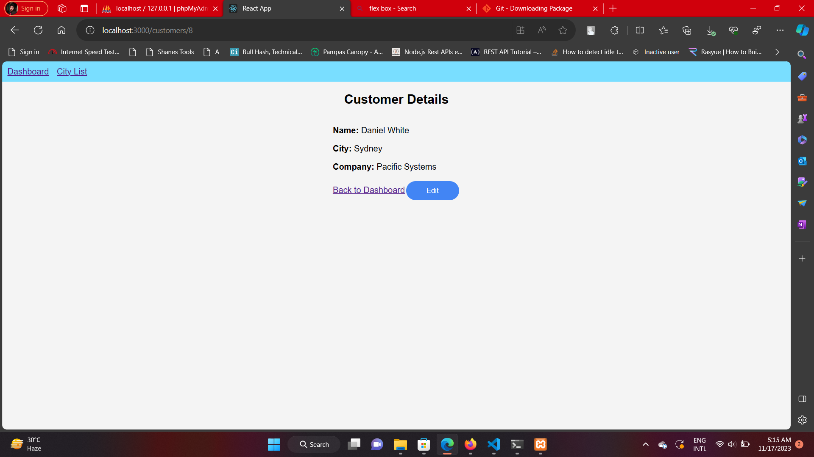
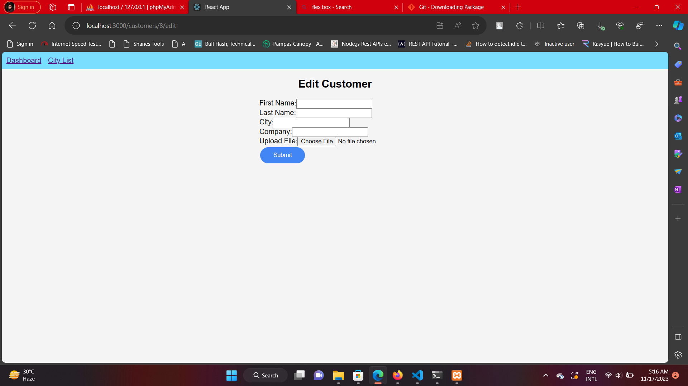

# Customer Management Frontend Documentation

## Overview

This frontend application provides a dashboard to manage customer data. It includes features such as listing customers, viewing customer details, editing customer information, and displaying a list of cities with the number of customers.

## Technologies Used

- React
- React Router DOM
- Axios (for API requests)
- HTML
- CSS (styles are included in the respective components)

## Project Structure

The project is organized with the following components:

- `App.js`: Main component containing the navigation and routes setup.
- `Customers.js`: Component to list all customers with search and pagination.
- `CustomerDetails.js`: Component to display detailed information about a single customer.
- `CityList.js`: Component to display a list of unique cities with the number of customers.
- `EditCustomer.js`: Component for editing customer details, including file upload.

## Getting Started

1. Clone the repository.
2. Install dependencies using `npm install`.
3. Start the development server with `npm start`.

## Dashboard

The dashboard is the entry point of the application and includes navigation links to:

- **Dashboard**: Lists all customers with search and pagination.
- 
- **City List**: Displays a list of unique cities with the number of customers.
- 

## Customer Details

Clicking on a customer's name in the dashboard navigates to the customer details page. Here, you can view detailed information about the selected customer.

## Editing Customer Details

To edit a customer's details, click the "Edit" button on the customer details page. This will redirect to the edit page, where you can modify customer information, including file uploads.

## Styling

Styling is done using basic CSS, and the styles are included within each component for simplicity.

## Additional Notes

- Ensure the backend server is running at `http://localhost:4000` or update the API URLs accordingly.
- Handle authentication and authorization as per your application's requirements.

Feel free to explore the source code for more details on component implementations.
